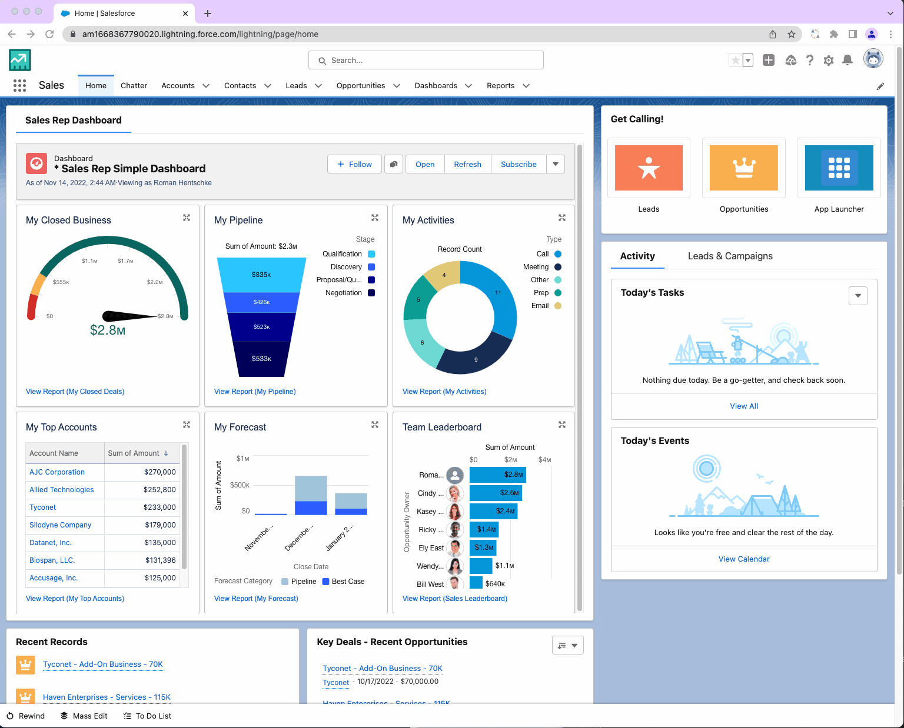

#  Salesforce User Switcher

This little Google Chrome extension helps Salesforce admins to login as another user.

When you work as a Salesforce administrator in orgs with lots of users you might find it difficult to login as another user. 
You not only have to navigate Setup with tons of clicks, find the correct user, login and then find your context again. Not cool...

From now on you can use this little Google Chrome Extension which will let you login as any user directly without losing focus to the current open Salesforce page.

Pretty awesome, right? 🥳

## Features

- Query all active users with a standard Salesforce license
- Search the list of users by first name, last name, profile name or user role name
- Login as any user by a single click
- Logout again at any time and automatically get back to the page where you came from prior login 
- Directly open User, Profile or Role in Setup

## Remarks

- Login access policies must be configured for system administrators.
- Check Setup --> Security --> "Login Access Policies" and make sure "Administrators Can Log in as Any User" is enabled
- This extension does not work with Salesforce Profession Edition, because it does not support login access policies
- When you logout as a user, you might have to completely re-login again. This is a setting, which can be configured in your Salesforce org as described in this help article:
  [System administrator gets logged out when they use 'Login as User'](https://help.salesforce.com/s/articleView?id=000381482&type=1)

## Install

This extension is available from the [Chrome Web Store](https://chrome.google.com/webstore/detail/salesforce-user-switcher/pbnfaealehoginodoagklmohliobpenb).

## Contribution

Suggestions and pull requests are highly welcome.

---

This project was bootstrapped with [Chrome Extension CLI](https://github.com/dutiyesh/chrome-extension-cli)

Icon source: <a href="https://www.flaticon.com/free-icons/switch" title="switch icons">Switch icons created by Darius Dan - Flaticon</a>
